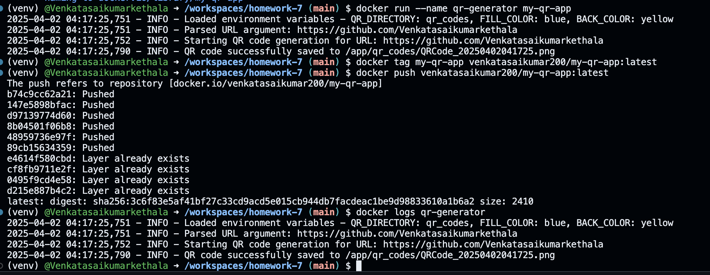

# Homework-7: QR Code Generator with Docker & Python


## QR Code Linking to My GitHub Homepage


## Log of QR Code Creation


```bash
(venv) @Venkatasaikumarkethala ➜ /workspaces/homework7 (main) $ docker run --rm --name qr-generator   -e QR_CODE_DIR='qr_codes'   -e FILL_COLOR='blue'   -e BACK_COLOR='yellow'   my-qr-app
2025-03-31 12:59:53,620 - INFO - Loaded environment variables - QR_DIRECTORY: qr_codes, FILL_COLOR: blue, BACK_COLOR: yellow
2025-03-31 12:59:53,620 - INFO - Parsed URL argument: https://github.com/Venkatasaikumarkethala
2025-03-31 12:59:53,620 - INFO - Starting QR code generation for URL: https://github.com/Venkatasaikumarkethala
2025-03-31 12:59:53,649 - INFO - QR code successfully saved to /app/qr_codes/QRCode_20250331125953.png
